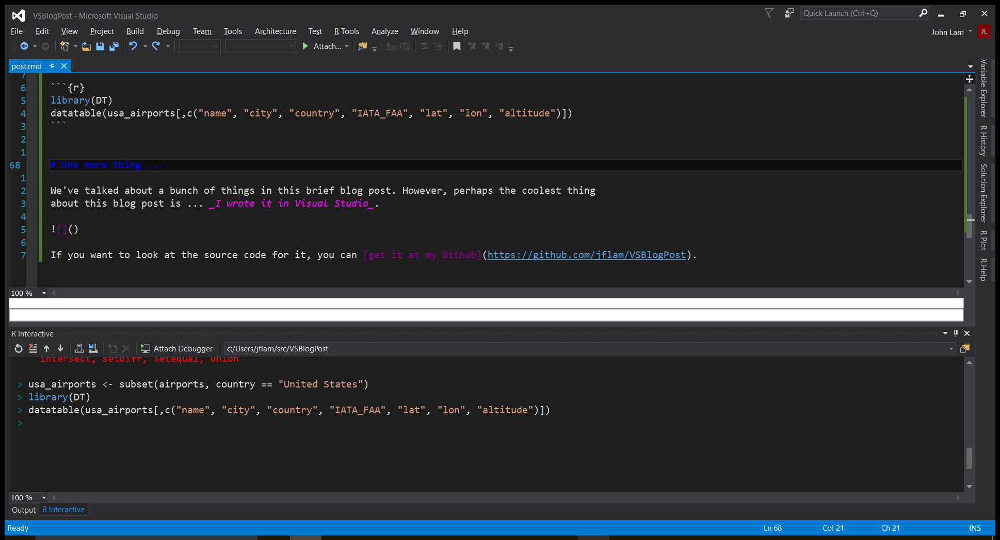

[R is a programming language](https://www.r-project.org/) that is widely used by data scientists, 
and developers seeking a more powerful tool to work with data. While data scientsts use R to 
write programs, their work product is rarely the program itself. Instead, they produce reports
or pressentations from the results generated by their R program to help influence or drive 
businesss decisions.

R Tools for Visual Studio (RTVS), currently available as a Public Preview release, can be [downloaded 
by following the instructions here](https://microsoft.github.io/RTVS-docs/installation.html), and you 
can [read our documentation here](https://microsoft.github.io/RTVS-docs/). 

Here’s a video that walks you through the major features of the product:

<iframe width="560" height="315" src="https://www.youtube.com/embed/KPS0ytrt9SA" frameborder="0" allowfullscreen></iframe>

R is an interpreted language that draws a lot of inspiration from other languages. Here’s a quick tour 
of R using RTVS, showing some of the more interesting modern R idioms.

At its simplest, you can think of R as an interpreted language where you can quickly interact with 
the runtime context through a Read-Eval-Print Loop (REPL). In RTVS, we call the REPL the R 
Interactive Window. As you can see, you can type 3 + 4 and have the result immediately computed by 
R; no compilation step necessary:

```{r}
3 + 4
```

The most heavily used data structure in R is the [R dataframe](http://www.r-tutor.com/r-introduction/data-frame). 
There are many ways of getting data into an R dataframe, but perhaps the easiest is to get it via
a URI. Below, we're reading a CSV file from Github: TODO: make sure to chnage URI once I upload the file

```{r}
usa_airports <- read.csv("usa_airports.dat")
colnames(usa_airports) <- c("ID", "name", "city", "country", "IATA_FAA", "ICAO", "lat", "lon", "altitude", "timezone", "DST", "Region")
head(usa_airports)
```

In R, you assign variables using the `<-` operator. You call functions using parenthesis. So in the
code above, we're invoking the `read.csv()` R library function, passing in the URI to the CSV file. Next, we're
using another R function, `head()` to display a summary of the first 5 lines of the file.

In R we can do ...

```{r}
library(dplyr)
new_york_airports <- subset(usa_airports, city == "New York")
```

In the example above, we're displaying the data in a very primitive console-oriented way. That's not
surprising since [R has been around since 1993](https://en.wikipedia.org/wiki/R_(programming_language)). 
Surely we can do better in 2016? 

As it turns out, we can. There are a lot of libraries in R that bind the R programming language to the
most powerful hardware-accelerated rendering platform on the planet: HTML. In R, this is accomplished
through a set of Open Source libraries known as [htmlwidgets for R](http://www.htmlwidgets.org/). Below
is the same dataframe rendered using the DataTable widget:

```{r}
library(DT)
datatable(new_york_airports[,c("name", "city", "country", "IATA_FAA", "lat", "lon", "altitude")])
```


# One more thing ...

We've talked about a bunch of things in this brief blog post. However, perhaps the coolest thing
about this blog post is ... _I wrote it in Visual Studio_. If you want to look at the source code 
for it, you can [get it at my Github](https://github.com/jflam/VSBlogPost).


